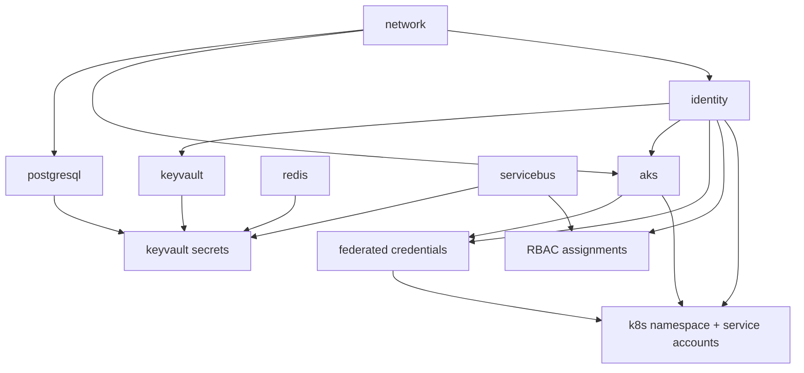

# ShopPulse — Terraform Infrastructure (Azure AKS)

Modular Terraform stack that provisions Azure infrastructure for the ShopPulse application:

| Component | Azure service | Module |
|-----------|---------------|--------|
| frontend, api, worker | AKS | `modules/aks` |
| PostgreSQL | Azure Database for PostgreSQL Flexible Server | `modules/postgresql` |
| Redis | Azure Cache for Redis | `modules/redis` |
| Message queue | Azure Service Bus (`sales-events`) | `modules/servicebus` |
| Secrets | Azure Key Vault | `modules/keyvault` |
| Networking | VNet, subnets, DNS | `modules/network` |
| Identity | User-assigned identities + Workload Identity | `modules/identity` |

## Prerequisites

- [Terraform](https://developer.hashicorp.com/terraform/install) >= 1.5
- [Azure CLI](https://learn.microsoft.com/cli/azure/install-azure-cli) logged in (`az login`)
- Sufficient Azure permissions to create resource groups, AKS, databases, and role assignments
- `subscription_id` for your Azure subscription

## Quick start

```bash
cd infra/terraform

# 1. Configure variables
cp terraform.tfvars.example terraform.tfvars
# Edit terraform.tfvars — set subscription_id at minimum

# 2. Initialize providers and modules
terraform init

# 3. Preview changes
terraform plan

# 4. Apply (creates all resources, ~20–40 min for first run)
terraform apply

# 5. Configure kubectl
az aks get-credentials \
  --resource-group $(terraform output -raw resource_group_name) \
  --name $(terraform output -raw aks_cluster_name)
```

## Module dependency graph

Resources are wired through root `main.tf`. Apply order follows this dependency chain:



### What each module exports and consumes

| Module | Key outputs | Consumed by |
|--------|-------------|-------------|
| **network** | `resource_group`, `aks_subnet_id`, `postgres_subnet_id`, `vnet_id` | postgresql, aks, identity (RG) |
| **identity** | UAMI IDs/client IDs for AKS, worker, api, keda | aks, keyvault, federated credentials, RBAC |
| **postgresql** | `fqdn`, `database_name` | keyvault secrets (`database-url`) |
| **redis** | `connection_string`, `hostname` | keyvault secrets (`redis-url`) |
| **servicebus** | `namespace_id`, `primary_connection_string` | keyvault secrets, RBAC |
| **keyvault** | `key_vault_id`, `key_vault_uri` | secrets submodule |
| **aks** | `oidc_issuer_url`, `kube_admin_config` | federated credentials, kubernetes provider |

## Workload Identity & KEDA

The stack configures [AKS Workload Identity](https://learn.microsoft.com/azure/aks/workload-identity-overview) for:

- **`keda-servicebus`** — federated credential bound to Service Account `keda-servicebus` in namespace `shoppulse`. Granted `Azure Service Bus Data Receiver` for KEDA autoscaling on queue depth.
- **`worker`** — receives messages from Service Bus.
- **`api`** — sends events to the `sales-events` queue.

Root `main.tf` creates:

1. Federated identity credentials (issuer = AKS OIDC URL)
2. Kubernetes namespace `shoppulse`
3. Service accounts annotated with `azure.workload.identity/client-id`

Example KEDA `TriggerAuthentication` (Helm/manifests, not managed by Terraform):

```yaml
apiVersion: keda.sh/v1alpha1
kind: TriggerAuthentication
metadata:
  name: azure-servicebus-auth
  namespace: shoppulse
spec:
  podIdentity:
    provider: azure-workload
    identityId: <keda identity client id from terraform output>
```

## Key Vault secrets

Passwords are generated with `random_password` (PostgreSQL admin) or by Azure (Redis access key, Service Bus connection string). Stored in Key Vault:

| Secret name | Description |
|-------------|-------------|
| `database-url` | `postgresql+asyncpg://…` DSN for api/worker |
| `redis-url` | `rediss://…` connection string |
| `servicebus-connection-string` | Namespace connection string |
| `servicebus-queue-name` | `sales-events` |

Workload identities receive **Key Vault Secrets User** RBAC on the vault.

## Service Bus queues

Queue names match [servicebus-config.json](../../servicebus-config.json):

- `sales-events` — lock duration 1m, TTL 1h, max delivery count 3

## Useful outputs

```bash
terraform output aks_cluster_name
terraform output key_vault_name
terraform output identity_client_ids
terraform output get_aks_credentials_command
```

## Destroy

```bash
terraform destroy
```

> Key Vault soft-delete is enabled. In `dev`, purge-on-destroy is configured via provider features.

## Directory layout

```
infra/terraform/
├── main.tf                 # Module orchestration + glue resources
├── variables.tf
├── outputs.tf
├── providers.tf            # azurerm, random, kubernetes, helm
├── terraform.tfvars.example
├── README.md
└── modules/
    ├── network/
    ├── identity/
    ├── aks/
    ├── postgresql/
    ├── redis/
    ├── servicebus/
    └── keyvault/
        └── secrets/        # Key Vault secret writer submodule
```

## Next steps (outside Terraform)

- Build and push container images (frontend, api, worker) to ACR
- Deploy Helm charts / manifests referencing Key Vault via Secrets Store CSI Driver
- Configure KEDA `ScaledObject` for worker targeting `sales-events` queue
- Point frontend ingress at the API service
