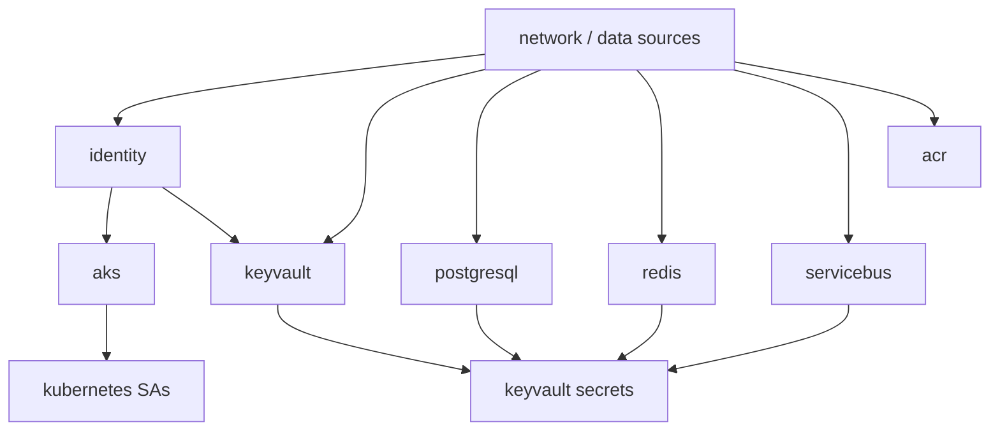

# ShopPulse — Terraform (Azure)

One root stack that calls reusable modules (mentor layout). No separate `terraform-data` copy.

```
infra/terraform/
├── README.md
├── providers.tf
├── variables.tf
├── locals.tf
├── outputs.tf
├── network.tf          # module.network or data sources
├── identity.tf
├── keyvault.tf
├── postgresql.tf
├── redis.tf
├── servicebus.tf
├── acr.tf
├── aks.tf
├── secrets.tf
├── kubernetes.tf
└── modules/
    ├── network/
    ├── identity/
    ├── aks/
    ├── postgresql/
    ├── redis/          # Azure Managed Redis + private endpoint
    ├── keyvault/       # PE + purge protection + RBAC
    ├── servicebus/
    └── acr/            # Premium + private endpoint
```

## Modes

| Mode | Flags | What you get |
|------|-------|----------------|
| **Full app** (default) | `create_network=true`, `enable_aks=true`, `enable_servicebus=true` | RG/VNet, AKS, identities, SB, PE-hardened data plane |
| **Data layer only** | `enable_aks=false` (optionally `enable_servicebus=false`) | ACR, KV, Redis, PostgreSQL with private endpoints — no AKS |
| **Existing VNet** | `create_network=false` | Reuses RG/VNet/subnets via `data` sources |

## Prerequisites

- Terraform >= 1.5
- Azure CLI (`az login`)
- Permissions to create RG, networking, data services, and (if enabled) AKS

```powershell
az login
$env:ARM_SUBSCRIPTION_ID = (az account show --query id -o tsv)
```

## Quick start — full stack

```powershell
cd infra/terraform
cp terraform.tfvars.example terraform.tfvars
# edit tfvars if needed

terraform init
terraform apply -var="key_vault_public_network_access_enabled=true"
# lock Key Vault after secrets are written:
terraform apply -refresh=false -var="key_vault_public_network_access_enabled=false"
```

Key Vault starts closed (`public_network_access_enabled=false`). The first apply from a laptop must temporarily open it so Terraform can write secrets; your public IP is auto-allowed via `api.ipify.org`.

## Data-layer only (private endpoints homework)

Same modules — turn AKS off:

```powershell
terraform apply `
  -var="enable_aks=false" `
  -var="enable_servicebus=false" `
  -var="postgres_sku_name=GP_Standard_D2s_v3" `
  -var="key_vault_public_network_access_enabled=true"
```

Then lock KV:

```powershell
terraform apply -refresh=false `
  -var="enable_aks=false" `
  -var="enable_servicebus=false" `
  -var="postgres_sku_name=GP_Standard_D2s_v3" `
  -var="key_vault_public_network_access_enabled=false"
```

### Existing network instead of creating one

1. Ensure RG + VNet exist with subnets `postgres` (delegated) and `private-endpoints`.
2. Apply with `create_network=false` (and subnet name overrides if needed).

## Redis note

Azure no longer allows creating **Azure Cache for Redis**. This stack uses **Azure Managed Redis** (`Balanced_B0` by default) with:

- `public_network_access = Disabled`
- private endpoint (`redisEnterprise`)
- DNS zone `privatelink.redis.azure.net`

## Secrets in Key Vault

| Secret | When |
|--------|------|
| `database-url` | always |
| `redis-url` | always (Managed Redis access key) |
| `postgres-password` | always |
| `servicebus-connection-string` | `enable_servicebus=true` |
| `servicebus-queue-name` | `enable_servicebus=true` |

## Module graph


```mermaid
flowchart TD
  network[network / data sources]
  identity[identity]
  keyvault[keyvault]
  postgresql[postgresql]
  redis[redis]
  servicebus[servicebus]
  acr[acr]
  aks[aks]
  secrets[keyvault secrets]

  network --> identity
  network --> keyvault
  network --> postgresql
  network --> redis
  network --> servicebus
  network --> acr
  identity --> aks
  identity --> keyvault
  postgresql --> secrets
  redis --> secrets
  servicebus --> secrets
  keyvault --> secrets
  aks --> k8s[kubernetes SAs]
```

`enable_aks=false` skips identity, aks, and kubernetes resources. `enable_servicebus=false` skips Service Bus and its secrets.

## Outputs

Useful after apply:

```powershell
terraform output acr_login_server
terraform output key_vault_name
terraform output get_aks_credentials_command
```

App deploy manifests: [../k8s/README.md](../k8s/README.md).
