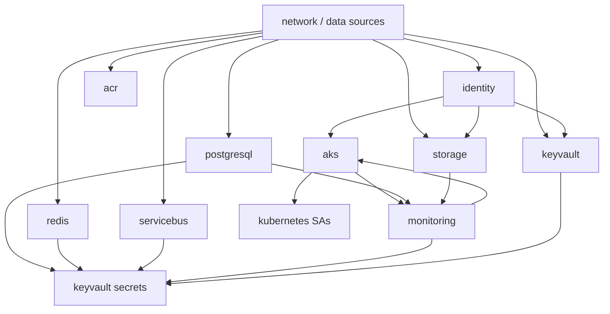

# ShopPulse — Terraform (Azure)

One root stack that calls reusable modules (mentor layout). No separate `terraform-data` copy.

## Kubernetes app manifests

Application Deployment/Service YAML lives in [`./k8s/`](./k8s/) (applied via `scripts/deploy.ps1` or `kubectl`, not as Terraform `kubernetes_*` resources).

```
infra/terraform/
├── README.md
├── providers.tf
├── variables.tf
├── locals.tf
├── outputs.tf
├── network.tf          # module.network or data sources
├── identity.tf
├── keyvault.tf
├── postgresql.tf
├── redis.tf
├── servicebus.tf
├── acr.tf
├── aks.tf
├── monitoring.tf
├── storage.tf
├── secrets.tf
├── kubernetes.tf
└── modules/
    ├── network/
    ├── identity/
    ├── aks/
    ├── postgresql/
    ├── redis/          # Azure Managed Redis + private endpoint
    ├── keyvault/       # PE + purge protection + RBAC
    ├── servicebus/
    ├── acr/            # Premium + private endpoint
    ├── monitoring/     # Log Analytics, App Insights, alerts, diagnostic settings
    └── storage/        # private blob account + lifecycle policy
```

## Modes

| Mode | Flags | What you get |
|------|-------|----------------|
| **Full app** (default) | `create_network=true`, `enable_aks=true`, `enable_servicebus=true` | RG/VNet, AKS, identities, SB, PE-hardened data plane |
| **Data layer only** | `enable_aks=false` (optionally `enable_servicebus=false`) | ACR, KV, Redis, PostgreSQL with private endpoints — no AKS |
| **Existing VNet** | `create_network=false` | Reuses RG/VNet/subnets via `data` sources |
| **No telemetry** | `enable_monitoring=false` | Skips the workspace, Container Insights, App Insights and alerts |
| **No object storage** | `enable_storage=false` | Skips the blob account, so `/api/reports` stays disabled |

## Prerequisites

- Terraform >= 1.5
- Azure CLI (`az login`)
- Permissions to create RG, networking, data services, and (if enabled) AKS

```powershell
az login
$env:ARM_SUBSCRIPTION_ID = (az account show --query id -o tsv)
```

## Quick start — full stack

```powershell
cd infra/terraform
cp terraform.tfvars.example terraform.tfvars
# edit tfvars if needed

# once per subscription: creates the state storage account and writes backend.hcl
..\..\scripts\bootstrap-state.ps1

terraform init -backend-config=backend.hcl
terraform apply -var="key_vault_public_network_access_enabled=true"
# lock Key Vault after secrets are written:
terraform apply -refresh=false -var="key_vault_public_network_access_enabled=false"
```

Key Vault starts closed (`public_network_access_enabled=false`). The first apply from a laptop must temporarily open it so Terraform can write secrets; your public IP is auto-allowed via `api.ipify.org`.

ACR behaves the same way: it is private by default, so pushing images from a laptop or a GitHub-hosted runner needs `acr_public_network_access_enabled=true` (optionally narrowed with `acr_allowed_ip_cidrs`) and a re-apply with `false` afterwards. A self-hosted runner inside the VNet avoids the toggle entirely.

The report storage account has the same problem for the same reason — blob containers are created over the data plane, not the management API — so the first apply needs `storage_public_network_access_enabled=true` and a re-apply with `false`. Shared keys are disabled on that account, so Terraform authenticates as the caller and the module grants itself Storage Blob Data Contributor, then waits 60s for the role to propagate.

## Data-layer only (private endpoints homework)

Same modules — turn AKS off:

```powershell
terraform apply `
  -var="enable_aks=false" `
  -var="enable_servicebus=false" `
  -var="postgres_sku_name=GP_Standard_D2s_v3" `
  -var="key_vault_public_network_access_enabled=true"
```

Then lock KV:

```powershell
terraform apply -refresh=false `
  -var="enable_aks=false" `
  -var="enable_servicebus=false" `
  -var="postgres_sku_name=GP_Standard_D2s_v3" `
  -var="key_vault_public_network_access_enabled=false"
```

### Existing network instead of creating one

1. Ensure RG + VNet exist with subnets `postgres` (delegated) and `private-endpoints`.
2. Apply with `create_network=false` (and subnet name overrides if needed).

## Redis note

Azure no longer allows creating **Azure Cache for Redis**. This stack uses **Azure Managed Redis** (`Balanced_B0` by default) with:

- `public_network_access = Disabled`
- private endpoint (`redisEnterprise`)
- DNS zone `privatelink.redis.azure.net`

## Secrets in Key Vault

| Secret | When |
|--------|------|
| `database-url` | always |
| `redis-url` | always (Managed Redis access key) |
| `postgres-password` | always |
| `servicebus-connection-string` | `enable_servicebus=true` |
| `servicebus-queue-name` | `enable_servicebus=true` |
| `appinsights-connection-string` | `enable_monitoring=true` |

## Module graph


```mermaid
flowchart TD
  network[network / data sources]
  identity[identity]
  keyvault[keyvault]
  postgresql[postgresql]
  redis[redis]
  servicebus[servicebus]
  acr[acr]
  aks[aks]
  monitoring[monitoring]
  storage[storage]
  secrets[keyvault secrets]

  network --> identity
  network --> keyvault
  network --> postgresql
  network --> redis
  network --> servicebus
  network --> acr
  network --> storage
  identity --> aks
  identity --> keyvault
  identity --> storage
  monitoring --> aks
  aks --> monitoring
  postgresql --> monitoring
  storage --> monitoring
  postgresql --> secrets
  redis --> secrets
  servicebus --> secrets
  monitoring --> secrets
  keyvault --> secrets
  aks --> k8s[kubernetes SAs]
```

The two arrows between `aks` and `monitoring` are not a cycle: the cluster consumes the workspace ID for Container Insights, while the alerts and the diagnostic setting consume the cluster ID. Terraform resolves that per resource, which is also why the alert resources are gated on the `aks_enabled` boolean rather than on `aks_cluster_id != null` — a `count` cannot depend on a value that only exists after apply.

`enable_aks=false` skips identity, aks, and kubernetes resources. `enable_servicebus=false` skips Service Bus and its secrets. `enable_monitoring=false` and `enable_storage=false` skip telemetry and object storage.

## Outputs

Useful after apply:

```powershell
terraform output acr_login_server
terraform output key_vault_name
terraform output get_aks_credentials_command
terraform output log_analytics_workspace_name
terraform output reports_storage_account_url
```

App deploy manifests: [./k8s/README.md](./k8s/README.md).
